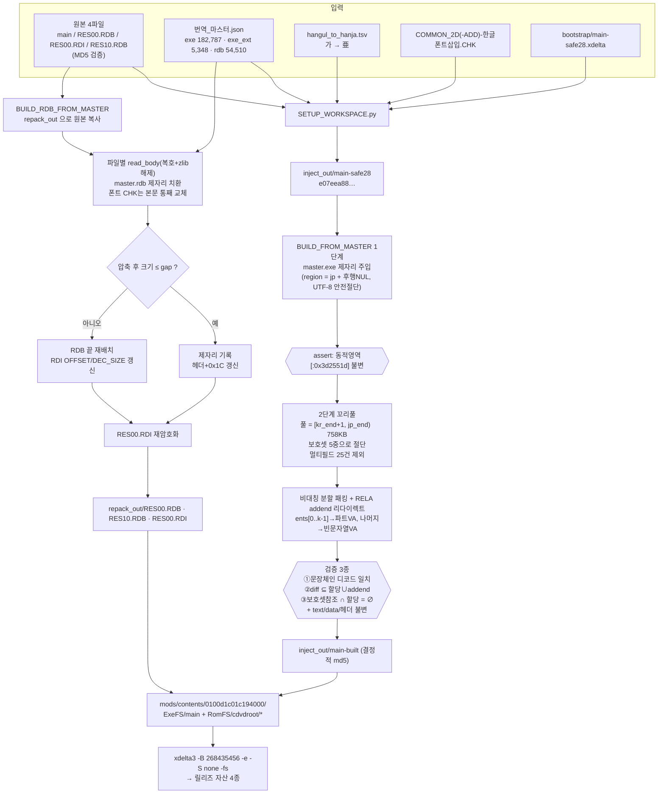

# ARCHITECTURE — 실황 파워풀 프로야구 2024-2025 (Switch) 한국어 패치 기술 구조

> 이 게임의 파일이 어떻게 생겼고, 한국어 텍스트가 어떤 원리로 그 안에 들어가는가.
> (한 줄 요약: **한자 글리프 셀에 한글을 그려 넣고, 텍스트는 그 한자 코드로 제자리 치환하며,
> 파일 크기는 절대 늘리지 않는다.**)

- 대상: 타이틀 ID `0100d1c01c194000`, 2024-2025 시즌 업데이트 **v1.8.0** 기준 덤프
- 원본 4파일 MD5 (`tools/SETUP_WORKSPACE.py`의 검증값)

  | 파일 | 위치 | MD5 |
  |---|---|---|
  | `main` | ExeFS | `916d81a491408bce1a1871efc24a6fa2` |
  | `RES00.RDB` | RomFS `cdvdroot/` | `46ccf287fd62e9e2d51b193e788555a0` |
  | `RES00.RDI` | RomFS `cdvdroot/` | `ad864a8bfb6b8bcf3b10481012a3f013` |
  | `RES10.RDB` | RomFS `cdvdroot/` | `25d0b86b64fa3fcc389b00359fde96cb` |

---

## 목차

1. [전체 구조 개요](#1-전체-구조-개요)
2. [NSO 실행파일 포맷 (`main`)](#2-nso-실행파일-포맷-main)
3. [RDB / RDI 아카이브 포맷](#3-rdb--rdi-아카이브-포맷)
4. [CHK 컨테이너와 STRING 청크](#4-chk-컨테이너와-string-청크)
5. [폰트 — UNCDFONT / FNTL / FNTS 와 한자 셀 트릭](#5-폰트--uncdfont--fntl--fnts-와-한자-셀-트릭)
6. [텍스트 주입 원리 (제자리 + 후행 NUL 슬랙)](#6-텍스트-주입-원리-제자리--후행-nul-슬랙)
7. [이벤트 대사 조각 조합 문제](#7-이벤트-대사-조각-조합-문제)
8. [꼬리풀(tail pool) 공법 — 현재 방식](#8-꼬리풀tail-pool-공법--현재-방식)
9. [번역_마스터.json 구조](#9-번역_마스터json-구조)
10. [빌드 파이프라인](#10-빌드-파이프라인)
11. [줄 규칙과 렌더링 제약](#11-줄-규칙과-렌더링-제약)

---

## 1. 전체 구조 개요

게임은 **실행파일 1개 + 리소스 아카이브 2개 + 인덱스 1개**로 구성된다.

| 파일 | 크기(원본) | 내용 |
|---|---|---|
| `main` | 약 106MB (무확장 빌드 결과 106,034,273B) | NSO0 실행파일. **텍스트의 압도적 다수가 여기 있다** — 메뉴·도움말·석세스/마이라이프/페넌트 이벤트 대사·능력명·업적 |
| `RES00.RDB` | 6.6GB | 주 리소스 아카이브 (CHK 파일들의 컨테이너) |
| `RES10.RDB` | 318MB | 보조 아카이브 (`SEN_TEXT*` 선수 소개문 등 일부 파일이 여기 소재) |
| `RES00.RDI` | 428KB | **암호화된 인덱스**. 두 RDB 전체의 파일명 → 오프셋/크기/플래그 테이블 |

핵심 감각:

- **텍스트 무게중심은 exe다.** 마스터 기준 exe 182,787건 vs RDB 54,510건.
  시나리오 대사는 전부 exe에 있고 RDB에는 대본형 파일이 없다(스캔 확인).
- RDB에 있는 텍스트는 **선수명(SEN_\*)·선수 소개문(SEN_TEXT\*)·팀/구장 라벨(NX SUR 위젯)·
  STRING 청크(중계 대사 등)** 성격이다.
- **폰트는 RDB 안**(`COMMON_2D.CHK`, `COMMON_2D_ADD.CHK`)에 있다. exe만 패치하면 글자가 안 나온다.

```
romfs/cdvdroot/
  RES00.RDI  ── (XOR 복호) ──▶ 15,543개 항목 { name, OFFSET, DEC_SIZE, flag }
  RES00.RDB  ── OFFSET*0x200 ──▶ [슬롯: 32B헤더 + zlib9(CHK 본문)]
  RES10.RDB  ── OFFSET ≥ 0x200000000 인 항목이 여기
exefs/
  main       ── NSO0 (flags=0, 무압축·무해시) : .text / .rodata / .data + bss
```

---

## 2. NSO 실행파일 포맷 (`main`)

`main`은 **NSO0, `flags`(헤더 `0x0C`) = 0x00**이다. 즉 **세그먼트 무압축 + 로드 시 해시 검증
없음** → 바이트 단위 편집이 그대로 통한다. `elf2nso` 재빌드 불필요(오히려 위험, [HISTORY](HISTORY.md) 참고).

### 2.1 헤더 필드 (실측 오프셋)

`tools/BUILD_FROM_MASTER.py` / `tools/EXPAND_NSO.py`가 읽는 위치:

| 오프셋 | 의미 |
|---|---|
| `0x00` | 매직 `NSO0` |
| `0x0C` | flags (이 게임 = `0x00`) |
| `0x10` / `0x14` / `0x18` | `.text` FileOffset / MemOffset(VA) / Size |
| `0x20` / `0x24` / `0x28` | `.rodata` FileOffset / MemOffset / Size |
| `0x30` / `0x34` / `0x38` | `.data` FileOffset / MemOffset / Size |
| `0x3C` | bss Size |
| `0x64` | `.rodata` 파일상 크기(압축 안 하므로 Size와 동일 역할) |

VA↔파일오프셋 변환은 세그먼트별 델타 하나면 된다:

```python
RO_DELTA = ROD_MO - ROD_FO      # rodata: fileoff + RO_DELTA = VA
```

### 2.2 MOD0 와 `.dynamic`

- `MOD0` 위치 = `TEXT_FO + u32(TEXT_FO + 4)` (텍스트 세그먼트 두 번째 워드가 MOD0 상대 오프셋)
- MOD0 필드는 **MOD0 자신의 VA 기준 상대 오프셋(int32)** 배열:
  `+4 dynamic`, `+8 bss_start`, `+0xC bss_end`, `+0x10 ehframe_start`, `+0x14 ehframe_end`,
  `+0x18 **module_object**` (런타임 write 대상 — 놓치면 2차 크래시)
- `.dynamic` 자체는 `.data`에 있다 (실측 VA `0x64e8620`).

실측된 주요 DT_ 값:

| 태그 | 값 |
|---|---|
| `DT_RELA` (7) | `0x2ab0058` |
| `DT_RELASZ` (8) | 엔트리 총 802,618개 (`RELACOUNT` = `0xc36e2` = 800,482) |
| `DT_JMPREL` (23) | `0x3d0edc8` (PLT 재배치 857개) |
| `DT_SYMTAB` (6) | `0x3d16020` (`SYMENT`=0x18) |
| `DT_STRTAB` (5) | `0x3d1bdc8` |
| `DT_PLTGOT`, `INIT_ARRAY`, `FINI_ARRAY` | `.data` 소재 |

### 2.3 DT_RELA 재배치 테이블 — **이 프로젝트의 심장**

`Elf64_Rela` 24바이트 고정: `{ u64 r_offset, u64 r_info, u64 r_addend }`.
문자열 포인터는 거의 전부 **`r_info == 0x403` (`R_AARCH64_RELATIVE`)** 엔트리로 표현되며,
로더(rtld)가 로드 시 `*(base + r_offset) = base + r_addend` 를 채운다.

> 즉 **`r_addend`(엔트리 시작 +16, 8바이트)가 "이 슬롯이 가리키는 문자열의 VA"** 다.
> 이 8바이트를 **정렬된 채로** 바꾸면 그것은 정상 재배치이고 부팅에 안전하다.
> 미정렬 write는 인접 엔트리의 `r_offset`/`r_info`를 파괴해 로더가 죽는다.
> (실제로 그렇게 죽였다 — [HISTORY §nnrtld](HISTORY.md#5-nnrtld-부팅-크래시--24b-레코드는-사실-dt_rela-엔트리였다))

### 2.4 영역 경계 (하드코딩 상수)

```python
DYN_HI = 0x3d2551d      # 동적 구조 영역 상한(파일 오프셋). 이 이하는 절대 손대지 않는다
```

- **동적 영역 `[0x2aafb79, 0x3d2551d]`** = DT_RELA / JMPREL / HASH / GNU_HASH / SYMTAB / STRTAB.
  이 구간은 **풀로 쓰거나 미정렬 write 금지**.
- **문자열 영역** = `DYN_HI` 초과 ~ `ROD_FO + ROD_SZ` (실측 관찰 범위 `0x3d27108`~`0x4870147`).
  모든 in-place 번역 주입은 이 안에서만 일어나며, 빌드 스크립트가 assert로 강제한다.
- **bss 시작 VA `0x651fad8`** — 첫 바이트부터 RELA 타깃이라 live. `.data` 뒤로 확장 불가.
- **대사 슬롯 포인터 배열 base `0x5d3d440`** (112,352 슬롯) — `.data` 소재.

---

## 3. RDB / RDI 아카이브 포맷

구현: `tools/rdblib.py`

### 3.1 암복호화 — XOR involution

파일별 키 스트림 XOR. **복호와 암호가 완전히 동일한 연산(involution)** 이고 byte-exact다.

```
key   = GenerateKey("RES00.RDI") ^ GenerateKey(파일명)
KT[64] = Keygen(key)
워드 i:  KT[i%64] ^= KT[(i+3)%64];  out[i] = data[i] ^ KT[(i+1)%64]
```

- 키 스트림 갱신이 **GF(2) 선형**이라 64워드 블록 단위로 상태를 미리 전개해 numpy 벡터화할 수 있다
  → `rdblib.crypt_fast` (~83MB/s, 레퍼런스 `crypt`와 byte-identical).
- ⚠ **슬롯 전체(32B 헤더 + 압축 본문)가 슬롯 시작을 기준으로 하는 단일 키 스트림**으로 암호화된다.
  헤더만 따로 복호하고 본문을 별도 스트림으로 다루면 안 된다.

### 3.2 RDI (인덱스)

복호하면 매직 `RDI2`.

| 오프셋 | 내용 |
|---|---|
| `0x0C` | flag3 (2면 레코드 시작 앞에 8바이트 추가) |
| `0x10` | file_count (실측 **15,543**) |
| `0x24` | last_table_entries |
| `0x30 + 8 (+8 if flag3==2)` | `NAME_OFFSET[file_count]` (u32 배열) |
| 그 뒤 | 레코드 배열 — **항목당 9바이트** `{u32 OFFSET, u32 DEC_SIZE, u8 flag}` (실측 시작 `0xF31C`) |
| 그 뒤 | 패치 테이블 `8 * last_table_entries` |
| 그 뒤 | 이름 풀 (NUL 종료 ASCII) |

- **`OFFSET` 은 섹터 단위**: 실제 바이트 오프셋 = `OFFSET * 0x200`.
- 실제 오프셋 **≥ `0x200000000` 이면 `RES10.RDB`** 소속 (값 − `0x200000000` 이 로컬 오프셋).
  → 재배치 시 `RES10`이면 섹터값에 `0x1000000`을 더한다 (`BUILD_RDB_FROM_MASTER.py` 참고).
- **`flag` 은 0 또는 0x20 만 유효**. 그 외 값은 파일이 아니라 ID이며 추출 불가.
  - `flag == 0x20` : zlib 압축. `DEC_SIZE = align_up(len(body), 4)`
  - `flag == 0` : 비압축. **`DEC_SIZE = align_up(32 + len(body), 4)`** ← 헤더 32바이트 포함!
    (이 32를 빼먹어 32바이트 잘림 버그가 있었다)

### 3.3 슬롯

```
[ 32바이트 헤더 ][ zlib deflate level 9 본문 ][ 무시되는 여분(패딩) ]
   헤더 +0x18 = 압축 크기(csize)
   헤더 +0x1C = 로컬 섹터 오프셋(자기 위치 / 0x200)
```

- 원본 압축은 `zlib.compress(body, 9)` 가 **바이트 그대로 재현**된다(레벨 9 확정).
- 파일이 커져서 원래 자리에 안 들어가면 **RDB 끝에 재배치** 후 RDI의 `OFFSET`/`DEC_SIZE`와
  슬롯 헤더 `+0x1C`를 갱신한다. 게임은 RDI(이름→오프셋)로만 접근하므로 재배치는 투명하다.
- 옛 슬롯은 고아(garbage)로 남지만 무해하다.

---

## 4. CHK 컨테이너와 STRING 청크

RDB 슬롯의 본문은 대개 `CHK ` 컨테이너다.

### 4.1 청크 워크

```
CHK 헤더 + 0x20 부터 청크 시작
 +16 data_info_off,  +20 data_start_off,  +24 data_count,  +28 sizes[]
 청크 구간 = [data_info_off, data_start_off)
 각 청크:  +8 = total_size,  +16..24 = ctype ("STRING", "UNCDFONT", "NX  SUR ", "HEADER", "TABLE", ...)
CHK 총 크기 = @0x2C
```

### 4.2 STRING 청크 (번역 대상 구조체)

```
base = STRING청크 + 0x10          # 포인터 테이블 시작
문자열[k] = base + u32(base + 4k) # NUL 종료 UTF-8
N = ptr[0] / 4                    # 문자열 개수
```

재구성 규칙(라운드트립 43/43 byte-identical 검증):

- `size1 @ (STRING+8)` = `(chunk_unpadded // 16 + 1) * 16`
  — `chunk_unpadded = 0x10 + len(body)`, **이미 16정렬이어도 항상 16바이트를 더 붙인다**.
  패딩 패턴은 `ff` + `cc`* .
- `size2 @ (STRING+0xC)` = `len(body) + 1`
- CHK 총 크기 `@0x2C` 는 **델타 갱신**(원본값 + (신 size1 − 구 size1)). 절대 공식은 파일마다 다름.
- STRING 뒤의 `TABLE`/`CHUNKEND` 청크는 문자열 **인덱스**를 참조하므로 그대로 보존.
- `HEADER` 청크에 `utf8_00` 태그가 있어 인코딩을 확인할 수 있다.

### 4.3 그 외 텍스트 형태

| 형태 | 설명 | 대표 파일 |
|---|---|---|
| STRING 청크 | 위 구조 (43개 파일) | `TEXT_HSIMSCH`, `CHATTABLE` |
| 고정 필드 레코드 | 이름 필드 **84바이트 고정**(이름 + 0 패딩) | `SEN_MAIN`, `SEN_MAIN_2ND` 등 15종 |
| 순차 레코드 | `[ID][UTF-8 텍스트][0 패딩]`, 포인터 참조 없음 | `SEN_TEXT`, `SEN_TEXT_2ND` (선수 소개문, **RES10 소재**) |
| NX SUR 위젯 라벨 | `01000002` + 색상 + 좌표 + 문자열 | 팀/구장/UI 라벨 CHK 471개 |
| 그냥 스캔 | NUL 경계 UTF-8 문자열 | 기타 |

⚠ **NUL 경계 + UTF-8 유효성만으로는 텍스트를 판별할 수 없다.** 바이너리 컨테이너의 임의 바이트가
UTF-8 CJK로 우연히 디코드된다. 반드시 가나 포함 여부 + 유니코드 블록 화이트리스트(`_plaus.py`)로
걸러야 한다 ([HISTORY §栄冠 멈춤](HISTORY.md#3-栄冠나인-멈춤--바이너리-오탐-주입-417k-복원) 참고).

### 4.4 텍스처 (NX SUR) — 참고

번역과 직접 관계는 적지만 같은 CHK 안에 있다.

- 청크 `ctype = "NX  SUR "`: `+32` 이름(.tsr), `+64` w, `+68` h,
  **`+0x54` 포맷코드**, **`+0x70` 데이터 블롭 크기**, **`+0xDC` = log2(block-height)**
- 블롭 위치 = `data_start_off + prefix_sum(sizes)` — `+0x70` 값을 `sizes[]` 와 **순서대로 크기 매칭**
  (two-pointer). 단순히 data_info 인덱스를 증가시키는 방식은 틀림.
- 포맷코드: `0x4B/0x4D/0x11`=BC7, `0x20`=BC1, `0x22/0x24/0x42`=BC3, `0x45`=BC4, `0x47`=BC5,
  `0x49`=BC6(불확실), `0x00`=비압축 RGBA(불확실). Tegra block-linear 디스위즐 필요.

---

## 5. 폰트 — UNCDFONT / FNTL / FNTS 와 한자 셀 트릭

### 5.1 왜 한자 셀에 한글을 그리는가

이 게임의 렌더러/폰트 테이블은 **글리프가 고정 슬롯**이고, 유니코드→글리프 인덱스 테이블이
바이너리에 박혀 있다. 한글 코드포인트(U+AC00~)를 **새로 추가**하려면 테이블 확장과
인덱스 재조정이 필요하고, 이는 파일 크기 변화와 참조 갱신을 부른다 — 이 게임에선 고위험이다.

그래서 반대로 간다:

1. **테이블은 손대지 않는다.** 기존 한자 글리프 셀의 **비트맵만** 한글 모양으로 덮어쓴다.
2. **텍스트는 한글 대신 그 한자 코드포인트로 저장**한다.
   `hangul_to_hanja.tsv` 가 `가 → 亜` 식의 1:1 매핑이며, 인코딩은
   `''.join(TSV.get(c, c) for c in ko).encode('utf-8')` 한 줄이다.
3. 게임은 자기가 한자를 그린다고 믿고 그리지만 화면에는 한글이 나온다.

부수 효과: **글리프 비트맵 길이가 불변**이므로 CHK 크기가 변하지 않고, 테이블/인덱스 변경이
0이라 구조적으로 안전하다. 대신 **TSV에 없는 음절은 렌더 불가**(전 코퍼스 실측 잔여 68 출현, 대부분 `큥`).

### 5.2 UNCDFONT 청크 내부 포맷

`COMMON_2D.CHK` / `COMMON_2D_ADD.CHK` 안에 `UNCDFONT` 청크가 2개 있다.

| 청크 | 글리프 크기 | 청크 오프셋(실측) | total_size | 글리프 슬롯 크기 |
|---|---|---|---|---|
| `FNTL` (대형) | 56×56 | `0x4200` | `0x5b9f10` | 1568B (4bpp = w*h/2) |
| `FNTS` (소형) | 44×44 | `0x5be110` | `0x390150` | 968B |

내부:

```
+0x20  글리프 수 (3787)
+0x24  글리프 폭 w
+0x28  글리프 높이 h
+0x3C  부터 12바이트 레코드 × 글리프수:
         u32 유니코드
         u32 오프셋 (청크 상대, 슬롯 단위 연속 = 0x8 + k*slot)
         u32 메트릭 (w << 8)
```

> ⚠ **함정**: 실제 글리프 비트맵은 레코드가 가리키는 오프셋에서
> **FNTL은 −6바이트, FNTS는 ±0** 위치에 있다. 이 델타를 모르면 추출/주입 시 초성이 잘려
> "발"이 "갈"로 보이는 식의 오판을 하게 된다.

### 5.3 폰트가 2종인 이유와 인코딩 단일화

- `COMMON_2D` (메인 폰트) 와 `COMMON_2D_ADD` (ADD 폰트) 두 벌이 있고,
  **화면 영역마다 어느 폰트로 렌더되는지가 다르다.**
- 과거에는 CHK 주입은 `wReplace`(가→一), exe 주입은 `tsv`(가→亜) 두 인코딩을 썼는데,
  실제 렌더는 ADD 폰트가 하는 경우가 많아 **선수명이 통째로 깨졌다.**
- 현재는 **`BUILD_FONT_TSV.py` 로 두 폰트 모두 tsv 매핑으로 통일**했다:
  새 메인 폰트 = 원본(전 셀 한자) + tsv에 해당하는 셀에만 ADD 폰트 글리프를 복사(델타·메트릭 포함).
  → **인코더는 `hangul_to_hanja.tsv` 하나뿐**이다. (`wReplace`는 폐기)

산출물은 저장소 `data/fonts/COMMON_2D-한글폰트삽입.CHK`,
`data/fonts/COMMON_2D_ADD-한글폰트삽입.CHK` 이며, 빌드 시 본문 통째 교체된다.

---

## 6. 텍스트 주입 원리 (제자리 + 후행 NUL 슬랙)

**대원칙: 파일 크기를 바꾸지 않는다. 포인터를 새로 만들지 않는다.**

### 6.1 구역(region) 계산

원본 일본어 문자열 하나가 차지하는 **쓸 수 있는 바이트 예산**은
"문자열 본문 + 그 뒤에 붙은 NUL 런"이다:

```python
jpb = jp.encode('utf-8')
e   = off + len(jpb)
T   = 0
while orig[e+T] == 0: T += 1      # 후행 NUL 런
region = len(jpb) + T             # 이 안에만 쓴다
```

컴파일러가 문자열을 정렬하며 남긴 패딩 NUL이 공짜 여유 공간이 된다.
한글은 UTF-8 3바이트/자, 원문 한자도 3바이트/자라 **의외로 대부분 들어간다**
(마스터의 `maxb` 필드가 이 예산이다).

### 6.2 UTF-8 안전 절단

예산을 넘으면 잘라야 하는데, **바이트 단위로 자르면 안 된다.**

```python
def fit(nb, region):
    if len(nb) > region - 1:            # -1 = NUL 종료자 자리
        nb = nb[:region-1]
        while nb:
            try: nb.decode('utf-8'); break
            except UnicodeDecodeError: nb = nb[:-1]
    return nb
```

이유: 매달린 UTF-8 **리드 바이트**(`e2` 등)가 남으면 렌더러가 그것을 3바이트 문자로 읽어
**뒤의 NUL 종료자까지 삼키고 다음 문자열로 bleed-in** 한다.
화면에는 굵은 `〓` 이 뜨고 그 지점부터 텍스트가 겹치거나 내부 ID(`CHE_assign_player` 등)가
그대로 노출된다. exe 잘림 35,913건 중 34,251건이 이 상태였다.
"연속 바이트만 제거"하는 구버전 코드는 이 버그를 못 잡는다 — **반드시 decode 성공까지 줄일 것.**

### 6.3 쓰고 남은 자리

```python
buf[off:off+len(nb)] = nb
buf[off+len(nb):off+region] = b'\x00' * (region - len(nb))
```

이 "쓰고 남은 뒷부분"이 §8의 **꼬리풀** 원료가 된다.

### 6.4 서식 문자열 주의

`printf` 계열 서식 문자열은 **`%` 지정자의 개수·타입·순서를 반드시 보존**해야 한다.
지정자가 **늘어나면** printf가 없는 인자를 `char*`로 읽어 가비지 포인터를 역참조 →
런어웨이/크래시다. 절단할 때도 지정자 토큰은 유지하고 리터럴만 줄여야 한다
(`FIX_FORMAT_EXE.py`의 `enc_fit`).

---

## 7. 이벤트 대사 조각 조합 문제

### 7.1 게임이 문장을 만드는 방식

이벤트 대사는 **완성된 문장으로 저장되어 있지 않다.**
`.data`의 포인터 배열(= DT_RELA 엔트리의 연속 런)에 **단어/어절 조각**이 표시 순서대로 놓여 있고,
렌더러가 이를 **인라인으로 이어붙이며** 자동 줄바꿈한다. 색상 단어, 루비(후리가나) 단어도
각각 독립 조각이다.

```
[今日] [は] [待] [ちに] [待] [った] [入団] [会見] [。]
   → 일본어: "今日は待ちに待った入団会見。"  (완벽)
```

`.rodata` 상의 인접성은 무의미하다(컴파일러가 dedup함). **대본은 RELA의 `r_offset` 연속 런**이며
스트라이드는 8/16/24/32가 관찰된다.

### 7.2 왜 한국어에서 깨지는가

한국어는 **앞 단어의 받침에 따라 조사가 바뀐다.** 조각 단위 번역으로는 원리적으로 불가능하다.

```
[오늘] [은] [기다림에] [기다림] [던] [입단] [회견] [。]
   → "오늘은은 기다림에 기다림던 입단회견"
```

- 조각을 통번역한 뒤 재분배(reflow)하는 시도도 실패했다: 슬롯 경계가 한국어 어순과 다르기 때문에
  "証明" 을 "しないと" 슬롯에 밀어넣어 "증명하지" 같은 오역/중복이 생긴다.
- 최종적으로 조각형 씬은 **슬롯 1:1 번역**(자기 몫만, 이웃 내용 이동 금지)으로 품질을 올렸고,
  그 위에 **완성 문장 리다이렉트**를 얹었다.

### 7.3 해결 = RELA addend 리다이렉트

각 대사를 이루는 조각들의 RELA 엔트리를 알고 있으므로:

1. 어딘가에 **완성된 한국어 문장 한 덩어리**를 기록한다.
2. **첫 조각 엔트리의 `r_addend`(엔트리 +16, 8바이트)를 그 문장의 VA로** 바꾼다.
3. **나머지 조각 엔트리는 전부 빈 문자열 VA**로 바꾼다.

결과: 렌더러는 여전히 "조각들을 순서대로 이어붙였을" 뿐인데 화면에는 완성 문장 + 빈 문자열들이
이어져 자연스러운 한 문장이 나온다.

**장점**: 조각 문자열 자체는 손대지 않으므로 그 조각을 공유하는 다른 대사가 영향받지 않는다.
addend는 8바이트 정렬된 정상 재배치 필드이므로 부팅에도 안전하다.

**남은 문제**: "완성 문장을 어디에 기록할 것인가". 이것이 이 프로젝트에서 가장 많은 실패를 낳았다
(죽은풀 → 셰이더 크래시, EXPAND → 28일차 크래시). 현재 답이 §8이다.

---

## 8. 꼬리풀(tail pool) 공법 — 현재 방식

구현: `tools/BUILD_FROM_MASTER.py` (기본 동작, `--no-mylife`로 끔)

### 8.1 풀의 정의

번역이 원문보다 짧아서 **남은 뒷부분**을 모아 쓴다.

```
슬롯 = [ 한글 번역 ][NUL][ ← 여기부터 원래 일본어였던 바이트 → ][ 원래 후행 NUL 런 ]
                          └────────── 꼬리 풀 [kr_end+1, jp_end) ──────────┘
                                                      (후행 NUL 런 T는 제외!)
```

```python
for off, (jl, T, kl) in slot_geo.items():
    jp_end = off + jl
    lo = off + kl + 1            # 한글 + NUL 종료자 다음
    hi = jp_end                  # ⚠ jp_end 까지. off+jl+T 가 아니다
```

- **후행 NUL 런 `T`를 절대 포함하지 않는다.** 그 0들이 인접 바이너리 테이블의
  0-프리픽스일 수 있기 때문(적대 검증에서 실증됨).
- 파일이 1바이트도 커지지 않는다. `.text`/`.data`/헤더 완전 불변.
- 규모: **758KB, 청크 평균 13바이트** — 극도로 파편화되어 있다.

### 8.2 5중 보호셋 — "이 바이트를 아무도 안 본다"는 증명

꼬리 안이라도 누군가 참조하면 못 쓴다. 참조 후보를 **과수집(over-collect)** 해서 모으고,
구간 안에서 첫 참조가 나오는 지점에서 꼬리를 **절단**한다.

| # | 보호 대상 | 수집 방법 |
|---|---|---|
| 1 | **원본 RELA 전 타입 addend** | `DT_RELA` 전체를 `(N,3) uint64`로 읽어 `[:,2]` |
| 2 | **safe28(현 베이스)의 RELA addend** | 과거 리다이렉트로 생긴 참조까지 반영. `r_info==0x403`만 |
| 3 | **JMPREL addend** | `DT_JMPREL` / `PLTRELSZ` |
| 4 | **SYMTAB `st_value`** | `(STRTAB - SYMTAB) / SYMENT` 만큼 순회, `+8` |
| 5 | **`.text` 코드 즉치 타깃** | `ADRP` + 뒤 8워드 내 같은 레지스터의 `ADD imm` 또는 `LDR/STR uimm` 페어 |

5번이 특히 중요하다. RELA에 없는 참조 — **코드가 `ADRP+ADD` 즉치로 주소를 계산해 직접 가리키는
UI 문자열**(세이브 확인창, 도감 라벨 등)이 실재한다. 이걸 빠뜨리면 그 문자열들이 파괴된다.

```python
is_adrp = (text & 0x9f000000) == 0x90000000
# ADD  imm : (w & 0xFFC00000) in (0x91000000, 0x91400000), sh면 imm<<=12
# LDR/STR  : (w & 0x3B000000) == 0x39000000, offset = imm12 << size
```

모든 참조 VA를 파일 오프셋으로 바꿔 `np.unique` 정렬해두고,
`first_ref_in(lo, hi)` 로 이분 탐색한다.

### 8.3 죽은조각(dead fragment) 재사용은 **폐기**

리다이렉트로 인해 아무도 안 가리키게 된 조각 문자열을 큰 청크로 재활용하려 했으나,
**적대 검증에서 코드가 `ADRP+ADD`로 직접 참조하는 UI 문자열을 파괴함이 실증**되어 폐기했다.
현재 코드에 삼중 보호 검사 로직은 남아 있으나 마이라이프 대상에서는 0청크가 나온다
(조각들이 전부 다른 곳에서도 참조되기 때문). **리다이렉트는 하되 조각 바이트는 그대로 둔다.**

### 8.4 비대칭 분할 패킹

청크 평균이 13바이트인데 문장은 수십~수백 바이트다. 그래서 **문장을 여러 파트로 쪼개
여러 청크에 나눠 담고**, `ents[0..k-1]`을 각 파트로, 나머지 ents를 빈 문자열로 리다이렉트한다.
게임이 어차피 ents 순서로 이어붙이므로 결과는 동일하다(v1.2에서 검증).

핵심 휴리스틱:

- **문장당 파트 수 ≤ `budget` = min(ents 길이)** — 조각 수보다 많이 쪼갤 수 없다.
- 매 파트를 **가장 큰 가용 청크**(`free[-1]`)로 채운다 → 큰 청크를 문장당 최소 개수만 소비.
  균등 분할보다 파편화된 풀에서 수납률이 훨씬 높다.
- 정렬 순서: `hardness`(파트당 필요 바이트 = `ceil((len+1)/budget)`) 내림차순 → 제약이 심한 것부터.
- 할당은 `bisect` best-fit. 실패하면 그 문장의 할당을 **롤백**하고 스킵(원본 조각 표시 유지).
- dedup 정렬 tie-break는 `key=(-len, bytes)` 로 **결정적**이어야 한다.
  (set 순회 해시 랜덤화 때문에 md5가 흔들린 적 있음)

파편화로 안 들어가는 긴 문장은 **축약 재번역** 워크플로로 처리했다(4라운드: 479→287→95→19→0).
결과 **5,244 / 5,244 완성 문장 전량 수납, 스킵 0**.

### 8.5 멀티필드(비연속 ents) 제외

```python
se = sorted(x['ents'])
if len(se) >= 2 and any(se[i+1]-se[i] != 24 for i in range(len(se)-1)):
    multifield += 1; continue      # 리다이렉트 대상에서 제외
```

RELA 스트라이드가 24가 아니면 = **사이에 구분 슬롯이 있다** = 이어지는 한 대사가 아니라
**별개 UI 필드**(제목/프롬프트/내레이션)다. 이어붙이면 필드가 깨진다.
**25건 제외**, 해당 항목은 safe28의 필드별 개별 번역 정렬을 그대로 보존한다.

### 8.6 3단계 자체 검증 (assert)

빌드 마지막에 세 가지를 강제한다. 하나라도 실패하면 산출물이 안 나온다.

1. **문장 체인 디코드 일치** — 각 문장의 ents를 순회하며 addend가 가리키는 문자열을 이어붙이고
   tsv 역디코드한 결과가 원래 `ko`와 정확히 같은가. (`bad == 0`)
2. **변경 바이트 규율** — stage1 대비 diff가 **`할당 구간 ∪ ents의 addend 8바이트`** 안에만 있는가.
3. **보호셋 침범 0** — `ref_fo` (모든 보호셋 참조 위치) 중 할당 마스크에 걸리는 것이 0인가.

추가로 헤더(`[:0x100]`) / `.text` 전체 / `.data` 이후 전체의 **바이트 불변** assert,
1단계 직후 **동적 영역(`[:DYN_HI]`) 불변** assert가 걸려 있다.

결과 산출: `inject_out/main-built` (**결정적** — 동일 마스터 → 동일 md5).

---

## 9. `번역_마스터.json` 구조

**번역 소스는 이 파일 하나다.** 과거의 `번역_일본어.json`, `_scene_tr_*`, `마이라이프_대사.json` 등은
전부 백업/참고용이며, 빌드는 마스터만 읽는다.

```jsonc
{
  "meta": { ... },
  "exe": [
    { "off": 64000000,        // main 파일 오프셋 (수정 금지)
      "jp": "原文",            // 원본 문자열 (일치 검사용)
      "ko": "번역",            // ← 수정 대상
      "maxb": 12 }             // 바이트 예산 = len(jp) + 후행 NUL 런
  ],
  "exe_ext": [
    { "ko": "오늘은 기다리고 기다리던 입단 기자회견.",
      "ents": [45023832, 45023856, ...] }   // 조각별 RELA 엔트리 **파일 오프셋**
  ],
  "rdb": [
    { "file": "SEN_MAIN.CHK",  // RDI 상의 파일명
      "off": 1234,             // CHK **본문**(압축 해제 후) 내 오프셋
      "jp": "原文", "ko": "번역", "maxb": 84 }
  ]
}
```

| 섹션 | 항목 수 | 의미 |
|---|---|---|
| `exe` | 182,787 | main의 문자열 영역 제자리 치환. `off <= DYN_HI` 이거나 `jp`가 원본과 불일치하면 스킵 |
| `exe_ext` | 5,348 | 마이라이프 등 **완성 문장 리다이렉트**. `ents` = 그 문장을 이루는 조각들의 RELA 엔트리 위치 |
| `rdb` | 54,510 | RDB CHK 안 문자열 제자리 치환 |

- `off`는 **절대 수정 금지**(원본 좌표계). 번역자는 `ko`만 만진다.
- 마스터는 **배포본에서 역추출**해 만들었다(배포본 vs 원본 diff 세그 → `{jp, ko, maxb}`).
  무손실 왕복이 검증되어 있다: 무수정 재주입 시 exe md5 = `e07eea88…`(=safe28), RDB 3종 완전 일치.
- ⚠ 베이스가 배포본(`main-safe28`)이므로, 배포본이 갱신되면 `BUILD_MASTER_*.py`로
  마스터를 재추출해야 최신과 동기된다. 단 **평소에는 재추출하지 말 것** — `BUILD_FROM_MASTER`는
  항상 safe28 + 마스터 전체 재주입이라 마스터만 고치면 결정적이고, 재추출은 이중 적용 위험이 있다.

### 9.1 부트스트랩 체인

원본 `main`에서 곧바로 빌드되지 않는다. `main-safe28`이 베이스다.

```
main (원본, 916d81a4…)
  └─ bootstrap/main-safe28.xdelta 적용 ─▶ inject_out/main-safe28 (e07eea88…)
        └─ BUILD_FROM_MASTER.py ─▶ inject_out/main-built
```

safe28은 순한자 UI 복구·서식 지정자 수리·접합부 정비 등 **오프셋 기반 누적 패치의 결과물**이라
마스터만으로 재현할 수 없다. 그래서 저장소가 xdelta로 들고 있다
(`tools/SETUP_WORKSPACE.py`가 적용·MD5 검증).

---

## 10. 빌드 파이프라인

### 10.1 명령

```bash
python tools/SETUP_WORKSPACE.py <작업공간> --orig <원본4파일_폴더>
set PAWA_ROOT=<작업공간>            # PowerShell: $env:PAWA_ROOT="..."

python tools/BUILD_FROM_MASTER.py       # → inject_out/main-built
python tools/BUILD_RDB_FROM_MASTER.py   # → repack_out/RES00.RDB, RES00.RDI, RES10.RDB
# 또는 둘 다 + 배포:
python tools/APPLY_MASTER.py --deploy
```

모든 도구는 `PAWA_ROOT` 환경변수로 작업 디렉터리를 잡는다(미지정 시 현재 디렉터리).

### 10.2 흐름도



### 10.3 RDB 빌드 세부

```python
need = align_up(32 + len(comp), 4)
if need <= gap(rdbn, local):      # 다음 파일 시작까지의 여유
    # 제자리: 헤더 +0x1C = local // SECTOR
else:
    # 재배치: cursor(파일 끝, 섹터 정렬)로. RES10이면 섹터값 += 0x1000000
    # RDI 레코드의 OFFSET / DEC_SIZE 갱신
```

- 슬롯 전체를 `crypt_fast(blob, file_key(name))` 로 재암호화해 쓴다.
- RDI는 마지막에 `crypt_fast(dec, RDI_KEY)` 로 통째 재암호화.
- 원본 6.6GB 복사가 느리므로(HDD ~70MB/s) `--fresh` 없이는 기존 `repack_out`을 재사용한다.
  고속 복사가 필요하면 `robocopy /J`. (⚠ PowerShell에서 robocopy는 **exit 1 = 성공**)

### 10.4 배포

```
mods/contents/0100d1c01c194000/
  ExeFS/main                      ← inject_out/main-built
  RomFS/cdvdroot/RES00.RDB
  RomFS/cdvdroot/RES00.RDI
  RomFS/cdvdroot/RES10.RDB
```

실기(Atmosphere)는 `atmosphere/contents/0100d1c01c194000/exefs/`, `romfs/cdvdroot/` (소문자).

릴리즈는 xdelta 바이너리 델타로 배포한다:
`xdelta3 -B 268435456 -e -S none -fs 원본 한글판 out.xdelta`
(`-9` / `-S djw`는 이미 압축된 데이터에 무익하고 느리기만 함)

---

## 11. 줄 규칙과 렌더링 제약

- **한 줄 = 전각 24자** (반각은 0.5로 계산). 초과 시 렌더러가 자동 줄바꿈한다.
- **대사창 = 3줄 = 폭 72**. 이를 넘으면 밀림/잘림이 발생한다.
- 검증 기준: 명시적 `\n`이 있으면 **각 줄 ≤ 24**, 없으면 **총 폭 ≤ max(원문 폭, 72)**.
  즉 "원문이 차지하던 줄 수보다 번역이 더 많은 줄을 쓰면 위험"이 판정 규칙이다.
- 폰트에 없는 문자 주의:
  - `·` (U+00B7) → **`・` (U+30FB)** 로 치환해야 함 (U+00B7 글리프 없음, 1,634건)
  - `—` (U+2014) → **`ー` (U+30FC)** (9건)
  - `…○※♪→×★☆①②®♥◆●÷~` 등은 원문 일본어에도 있으므로 글리프가 있다 → 유지
- 메뉴 라벨류는 **공백을 제거**한다(공백 없는 16자 이하 무구두점 라벨). 씬 대사는 제외.

---

## 부록: 도구 색인 (`tools/`)

| 도구 | 역할 |
|---|---|
| `SETUP_WORKSPACE.py` | 원본 MD5 검증 + 데이터 배치 + safe28 부트스트랩 |
| `BUILD_FROM_MASTER.py` | **exe 빌드 (현재 방식: 무확장 꼬리풀)** |
| `BUILD_RDB_FROM_MASTER.py` | **RDB 빌드 (원본 → 한국어 RDB 전체 재생성)** |
| `APPLY_MASTER.py` | exe + RDB 한 번에, `--deploy`로 mods 배포까지 |
| `rdblib.py` | RDB/RDI 포맷·암복호화·슬롯 읽기 (`crypt_fast`) |
| `EXPAND_NSO.py` | ❌ **폐기된 세그먼트 재배치 확장** (참고용, [HISTORY §6](HISTORY.md#6-세그먼트-재배치-확장expand_nso--마이라이프-28일차-크래시) 참조) |
| `BUILD_FONT_TSV.py` | 메인 폰트를 tsv 매핑으로 재구축 |
| `AUDIT_BOGUS.py` / `_plaus.py` | 바이너리 오탐 주입 감사 |
| `CANCEL_BAD_EXT.py` | 씬 오버리치 리다이렉트 취소 |
| `FIX_FORMAT_EXE.py` | `%` 서식 지정자 보존 재주입 |
| `COLLECT_UNTRANSLATED.py` | 절대 스캔 기반 미번역 수색 |
| `SCAN_RDB_LINE.py` / `REINJECT_RDB_LINEFIT.py` | 줄 규칙 검사·재주입 |
</content>
</invoke>
